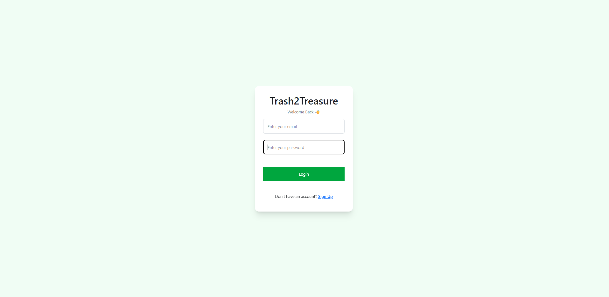
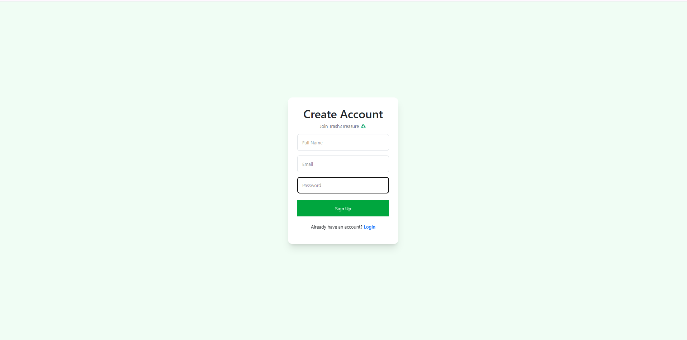
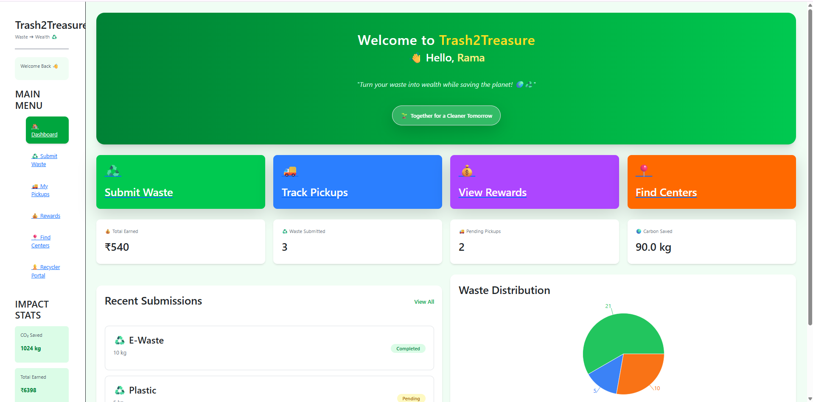
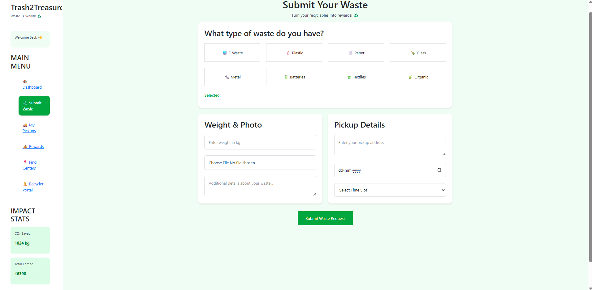
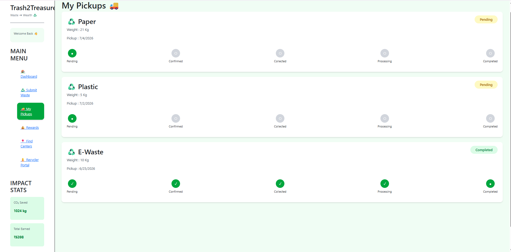
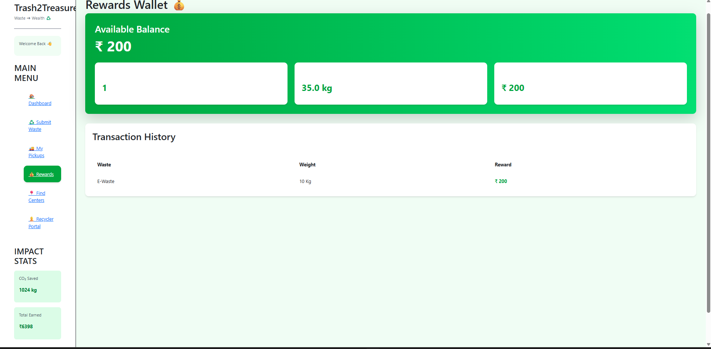
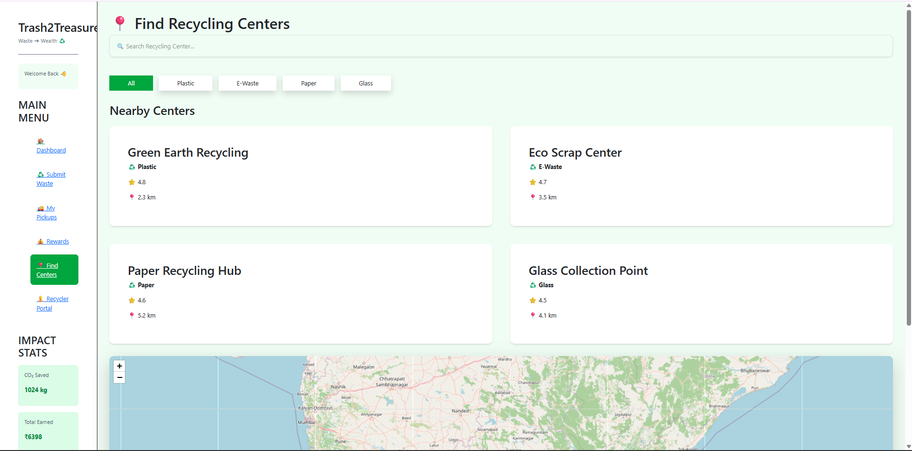
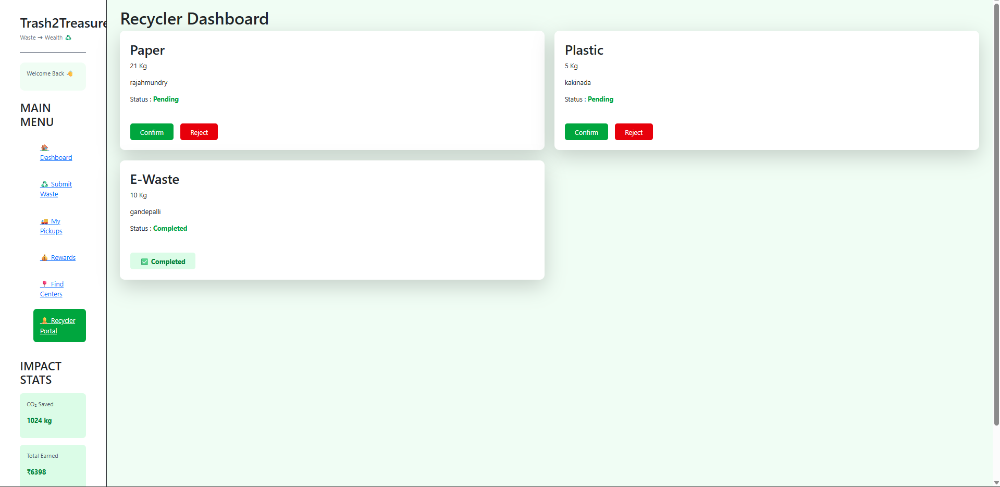

# ♻️ Trash2Treasure


An AI-powered Smart Waste Management platform built using the **MERN Stack** that enables users to submit recyclable waste, schedule pickups, and earn reward points for responsible recycling.

---

## 🚀 Features

- 🔐 User Authentication (JWT)
- ♻️ Submit Waste Requests
- 📦 Multiple Waste Categories
- 📅 Pickup Scheduling
- 🎁 Reward Points System
- 📊 User Dashboard
- 👨‍💼 Admin Waste Management

---

## 🛠️ Tech Stack

### Frontend
- React.js
- Tailwind CSS
- Axios

### Backend
- Node.js
- Express.js

### Database
- MongoDB Atlas
- Mongoose

### Authentication
- JSON Web Token (JWT)

---

## 📁 Project Structure

```text
Trash2Treasure
│
├── frontend
├── backend
└── README.md
```

---

## ⚙️ Installation

### 1. Clone the Repository

```bash
git clone https://github.com/YOUR_GITHUB_USERNAME/Trash2Treasure.git
```

### 2. Frontend Setup

```bash
cd frontend
npm install
npm run dev
```

### 3. Backend Setup

```bash
cd backend
npm install
npm run dev
```

---

## 🔑 Environment Variables

Create a `.env` file inside the **backend** folder.

```env
MONGODB_URI=your_mongodb_connection_string
JWT_SECRET=your_secret_key
PORT=5000
```

---

## 📸 Screenshots

### 🔑 Login


### 📝 Sign Up


### 📊 Dashboard


### ♻️ Submit Waste


### 🚛 My Pickups


### 🎁 Rewards


### 📍 Find Centers


### ♻️ Recycler Portal


## 🌱 Future Enhancements

- 🤖 AI Waste Detection
- 📍 Live Pickup Tracking
- 📱 Mobile Application
- 🎖️ QR-Based Rewards
- 📈 Admin Analytics Dashboard

---

## 👩‍💻 Author

**Vangmayi Karri**
Computer Science Engineering and Data Science,
Pragati Engineering College

---

⭐ If you like this project, don't forget to star the repository!